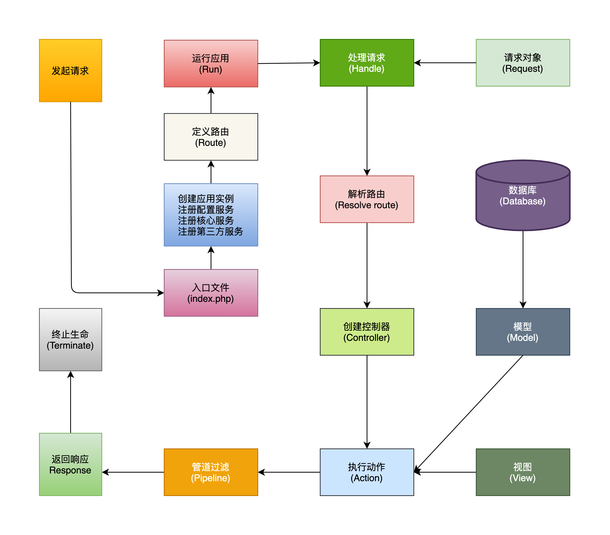

<p align="center"></p>

> Coole is a PHP framework built on open source components. - Coole 是一个基于开源组件构建的 PHP 框架。

[简体中文](README-zh_CN.md) | [ENGLISH](README.md)


[](https://codecov.io/gh/guanguans/coole)
[](//packagist.org/packages/guanguans/coole)
[](//packagist.org/packages/guanguans/coole)
[](//packagist.org/packages/guanguans/coole) [](https://gitter.im/guanguans/coole?utm_source=badge&utm_medium=badge&utm_campaign=pr-badge&utm_content=badge)

## Documentation

[www.guanguans.cn/coole](https://www.guanguans.cn/coole/)

## Life cycle

<p align="center"></p>

## Requirement

* PHP >= 7.3

## Installation

```shell script
$ composer require guanguans/coole -vvv
```

## Quick start

```php
<?php

use Coole\Foundation\App;
use Coole\Routing\Facades\Router;
use Symfony\Component\HttpFoundation\Request;

require __DIR__.'/vendor/autoload.php';

// 1. Create App.
$app = new App();
$app['debug'] = true;

// 2. Add route with closure middleware.
Router::get('/', function (){
    return 'This is the Coole framework.';
})->setMiddleware(function (Request $request, Closure $next){
    $response = $next($request);
    $response->headers->set('X-Coole-Version', App::version());

    return $response;
});

// 3. Run service.
$app->run();
```

## Testing

```bash
$ composer test
```

## Changelog

Please see [CHANGELOG](CHANGELOG.md) for more information on what has changed recently.

## Contributing

Please see [CONTRIBUTING](.github/CONTRIBUTING.md) for details.

## Security Vulnerabilities

Please review [our security policy](../../security/policy) on how to report security vulnerabilities.

## Credits

* [guanguans](https://github.com/guanguans)
* [All Contributors](../../contributors)

## Thanks

<a href="https://www.jetbrains.com" target="_blank">
    
</a>

## License

The MIT License (MIT). Please see [License File](LICENSE) for more information.
