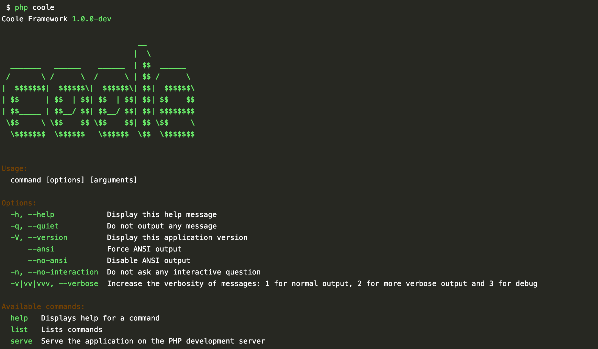

# 命令行

> 命令行 [symfony/console](https://github.com/symfony/console) 提供支持。



## 配置文件

默认 `config/console.php`。

```php
<?php

declare(strict_types=1);

/*
 * This file is part of the coolephp/skeleton.
 *
 * (c) guanguans <ityaozm@gmail.com>
 *
 * This source file is subject to the MIT license that is bundled.
 */

return [
    /*
     * 命令
     */
    'command' => [
        [
            // 命令文件所在目录
            'dir' => base_path('app/Command/'),

            // 命令文件命名空间
            'namespace' => 'App\Command',

            // 命令文件后缀
            'suffix' => '*Command.php',
        ],
    ],
];
```

## 编写命令

```php
<?php

namespace Guanguans\Coole\Console\Commands;

use Guanguans\Coole\Console\Command;
use InvalidArgumentException;
use Symfony\Component\Console\Input\InputInterface;
use Symfony\Component\Console\Input\InputOption;
use Symfony\Component\Console\Output\OutputInterface;

class ServeCommand extends Command
{
    protected $name = 'serve';

    protected $description = 'Serve the application on the PHP development server';

    protected $options = [
        ['host', null, InputOption::VALUE_OPTIONAL, 'The host address to serve the application on', '127.0.0.1'],
        ['port', null, InputOption::VALUE_OPTIONAL, 'The port to serve the application on', 8000],
        ['docroot', null, InputOption::VALUE_REQUIRED, 'The docroot to serve the application on', null],
    ];

    protected function execute(InputInterface $input, OutputInterface $output)
    {
        if (empty($this->input->getOption('docroot'))) {
            throw new InvalidArgumentException('Please set option of docroot.');
        }

        if (! file_exists($this->input->getOption('docroot'))) {
            throw new InvalidArgumentException(sprintf('Docroot directory not exist.: %s', $this->input->getOption('docroot')));
        }

        $this->output->writeln("<info>Coole development server started:</info> <http://{$this->input->getOption('host')}:{$this->input->getOption('port')}>");

        passthru($this->serverCommand(), $status);

        return parent::SUCCESS;
    }

    protected function serverCommand()
    {
        return sprintf('%s -S %s:%s -t %s',
            PHP_BINARY,
            $this->input->getOption('host'),
            $this->input->getOption('port'),
            $this->input->getOption('docroot'),
        );
    }
}
```

## 运行命令

``` bash
$ php coole serve
```
