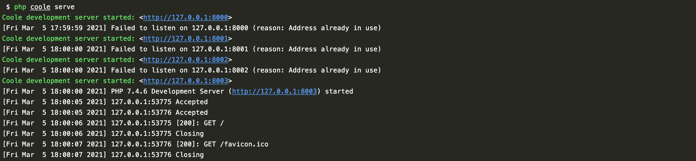
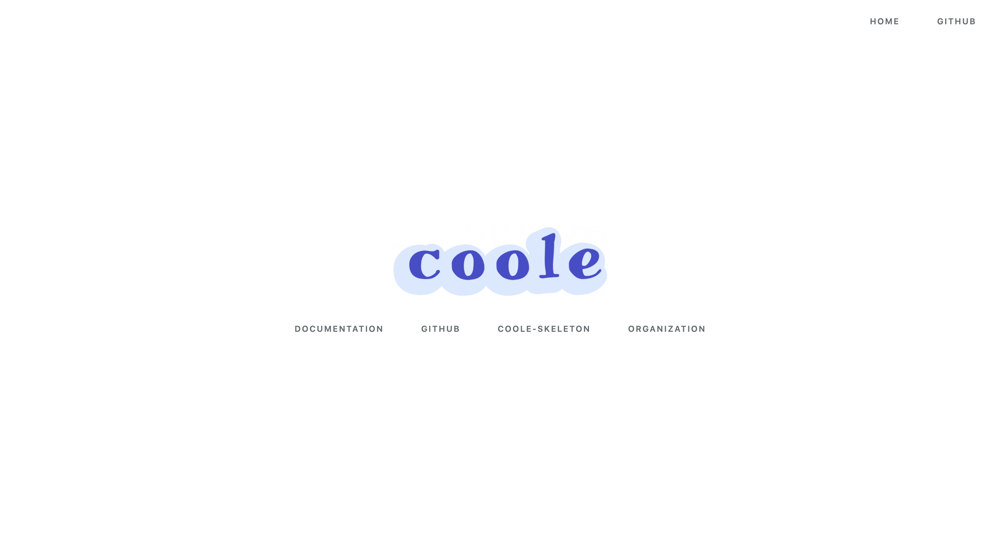

# 安装

## 环境要求

* PHP >= 7.2

## 安装 Coole

> Coole 使用 [Composer](https://getcomposer.org/) 来管理项目的依赖，在使用 Coole 之前，请确保你的运行环境已经安装好了 Composer。

```shell script
$ composer create-project coolephp/skeleton -vvv
```

## 启动 PHP 内置服务

```shell script
$ php coole serve
```



## 测试访问

### http://127.0.0.1:8000



### http://127.0.0.1:8000/api/v1/index

```json
{
    "name": "coolephp/skeleton",
    "description": "This is an official framework application template for Coole.",
    "homepage": "https://github.com/coolephp/skeleton",
    "author": {
        "name": "guanguans",
        "email": "ityaozm@gmail.com",
        "homepage": "https://www.guanguans.cn"
    }
}
```

## Web 服务器配置

### Apache

``` apacheconfig
Options +FollowSymLinks -Indexes
RewriteEngine On

RewriteCond %{HTTP:Authorization} .
RewriteRule .* - [E=HTTP_AUTHORIZATION:%{HTTP:Authorization}]

RewriteCond %{REQUEST_FILENAME} !-d
RewriteCond %{REQUEST_FILENAME} !-f
RewriteRule ^ index.php [L]
```

### Nginx

``` conf
location / {
    try_files $uri $uri/ /index.php?$query_string;
}
```