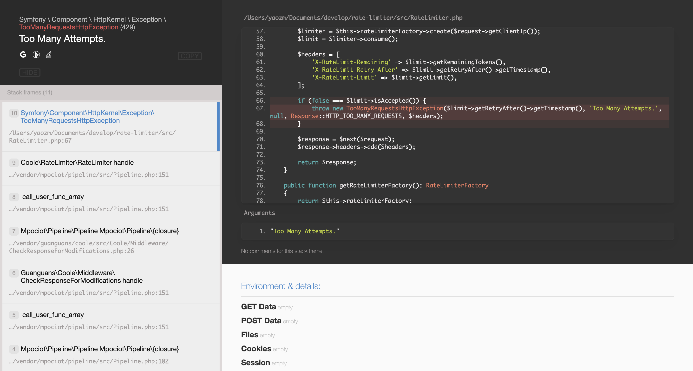
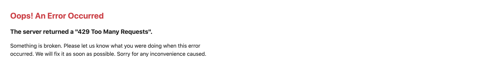

# rate-limiter

> 提供令牌桶实现来限制 Coole 应用程序中的输入和输出。

## 安装

``` bash
$ composer require coolephp/rate-limiter --prefer-dist -vvv
```

## 使用

1. 复制 `rate-limiter/config/rate-limiter.php` 为 `coole-skeleton/config/rate-limiter.php`.
2. 配置 `\Coole\RateLimiter\RateLimiter::class` 中间件.

```php
<?php

return [
    /*
     * App 名称
     */
    'name' => env('APP_NAME', 'Coole'),

    /*
     * 全局中间件
     */
    'middleware' => [
        ...
        \Coole\RateLimiter\RateLimiter::class
        ...
    ],
];
```





## 源码链接

* [https://github.com/coolephp/rate-limiter](https://github.com/coolephp/rate-limiter)

## 相关链接

* [https://github.com/symfony/rate-limiter](https://github.com/symfony/rate-limiter)